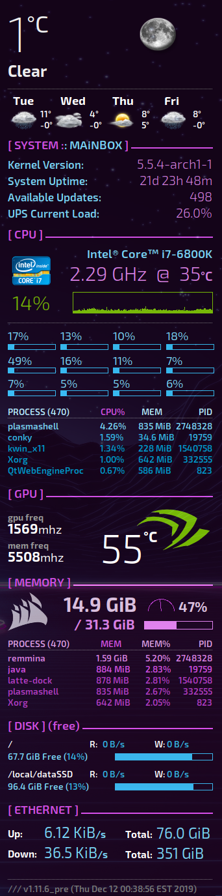

# Synthwave Neon Theme for Conky

### Conky theme with weather support and a spiffy layout:

---

### Dependencies:

- [**conky**](https://github.com/brndnmtthws/conky) v1.10+, as the new config file uses Lua syntax
- [**Exo 2 Font**](https://www.dafont.com/exo-2.font) for the proper font display, though you can use any you prefer (but may have to update font sizing in the config)
- [**apcaccess**](http://linux.die.net/man/8/apcaccess) for reading the *Load* level of the UPS (if APC UPS support is desired)

### Installation:

- Either clone the repository from Github, or [**download the latest zip**](https://github.com/scar45/conky_synthwave_neon/archive/master.zip) file
- Update the default references within `.conkyrc` to point to your local repository folder, or wherever you extracted the zip file. i.e.:
    - Use Find & Replace to modify `~/Design/icons/` in the default config to `_____PATH_TO_REPO_____/icons/`
- Ensure the **Exo 2 Font** (above) is installed in your custom/system font collection
- If weather support is desired, see below for how to create the JSON file that conky will parse
- Run this conky theme config with `conky -c _____PATH_TO_REPO_____/.conkyrc`

### Weather Support:

This theme relies on the DarkSky API to parse weather data from JSON. DarkSky offers [**free rate-limited API**](https://darksky.net/dev) access, so please create an account if you'd like to utilize the weather functionality in this theme. Once you've done so, you can simply pull the weather data every so often by using a **cron job**, or a **systemd timer** (take note of DarkSky's rate limits), which runs a command similar to:

`curl -s -o ~/.cache/weather.json "https://api.darksky.net/forecast/_____YOUR_API_KEY_____/_____LAT_____,_____LONG_____"`

This instructs `curl` to save the output to a JSON file. If you save the JSON output to somewhere other than `~/.cache/weather.json` path, you will need to modify that path in `.conkyrc`.

This theme will parse that JSON file (`~/.cache/weather.json`) on your local machine every so often, and use it to display the correct temperature values, and weather icons.

### .conkyrc edits for personalized info:

- [**line 19**](https://github.com/scar45/conky_solar_burn/blob/master/.conkyrc#L19) / Set `minimum_height` to your screen resolution height
- [**line 38**](https://github.com/scar45/conky_solar_burn/blob/master/.conkyrc#L38) / Set `update_interval` to your desired refresh interval (default 1s)
- [**line 70**](https://github.com/scar45/conky_solar_burn/blob/master/.conkyrc#L70) / Remove if you do not use `apcaccess` to obtain UPS status
- [**line 73**](https://github.com/scar45/conky_solar_burn/blob/master/.conkyrc#L73) / CPU model and optionally change image
- [**line 77**](https://github.com/scar45/conky_solar_burn/blob/master/.conkyrc#L77) / CPU cores (if not 12)
- [**line 113-116**](https://github.com/scar45/conky_solar_burn/blob/master/.conkyrc#L113) / Disk mapping for I/O stats, disk free, etc.

### Notes:

This layout was built for 1440p resolution, but you can adapt it by simply adding/removing anything really.

Hope you enjoy using this conky theme, and if you'd like, you can:

Cheers!
